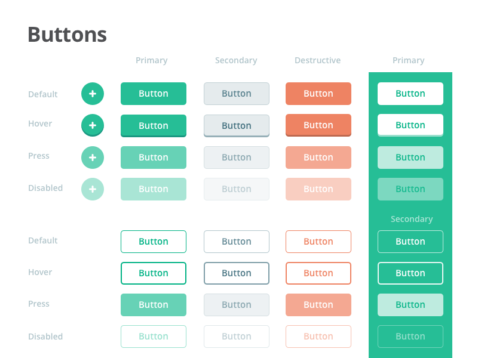
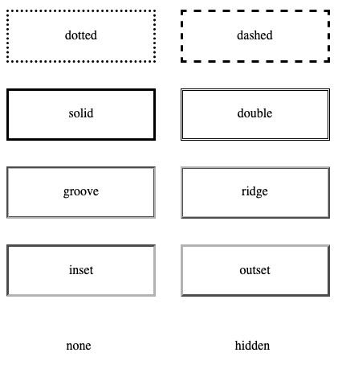
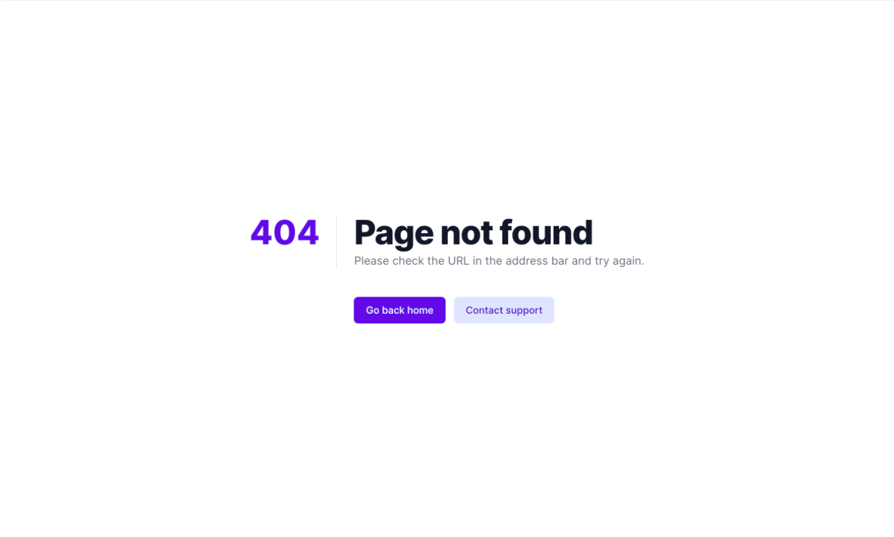
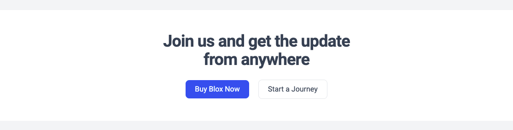
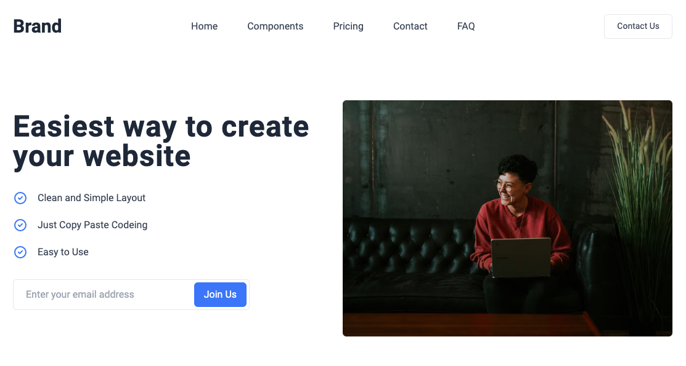
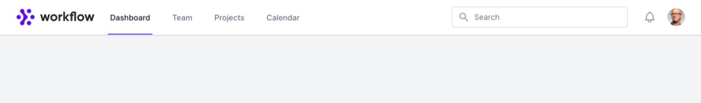
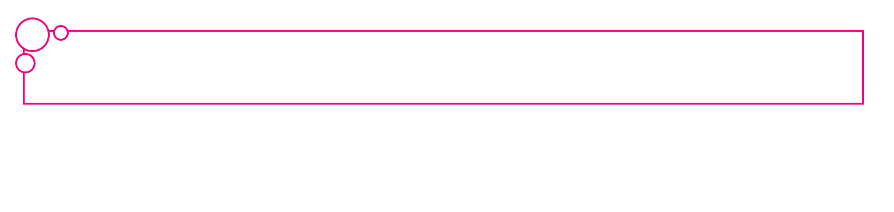
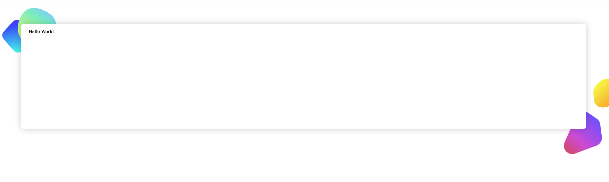

# WT-2021

## Assignments:
1. Create a college routine in HTML.
> Deadline: 23rd November, 12 pm

2. Create a web document to illustrate following using CSS:
* Color (name, rgb, hex, rgba, hsl, hsla)
* Text formatting (color, line height, font, font-weight, underline, stroke, itallic)
* Background (background color, background images, background size, background position)
> Deadline: 29th November, 11 pm

3. Buttons, Border, Color and Pseudo class.
* Create buttons as per given figure.
  
* Create borders as per given figure.

> Deadline: 2nd December, 12 pm

4. Design Navbar, CTA, Hero section and 404 page.
* As shown in the figure below, design 404 page.
   
* Design CTA section as shown in the figure below.
   
* As shown in the figure below, design Hero section.
   
* As shown in the figure below, design Navbar section.
   
> Deadline: 16th December, 10 am

5. Develop a simple calculator
> Deadline: 4th Jan, 6 am

6. Explain event bubbling and capture with an example

> Deadline: 11th Jan, 8 am

## Labs:

1. Lab 1: HTML Elements.
* Make a webpage with the following html elements:
   * Nested order and unorder list
   * semantics tags for the layout
   * text formatting tags
   * image, video and audio
   * iframe
> You can add additional elements and CSS to make the webpage more visually appealing.
> Deadline: 23 December, 8 am

2. Lab 2: Flow layout and Positioned layout in CSS.
* Create a wrapper element as shown in the figure below to fill the empty space in smaller viewports. It specifies a maximum width and will horizontally center itself within the parent if space is available. It includes some horizontal "breathing room" so that its children aren't pressed up against the viewport's edges.

> hint: `max-width`

* Design a circuit as shown in the figure.

* Design a decorative item as shown in the screenshot below.

> Note: assets are inside `assets/images/lab2` folder

> Deadline: 30th December, 8 am

3. Lab 3: Javascript Fundamentals
* WAP to reverse the string provided by the user.
* Write a function to check if the provided number is palindromic or not.
* Write a program to find the sum of prime number between 1 and 50.
* Write a function that reverse the provided array.
* Write a function that sorts the provided array based on the parameter (i.e. asc = ascending, desc = descending order).

> Deadline: 13th Jan, 8 am